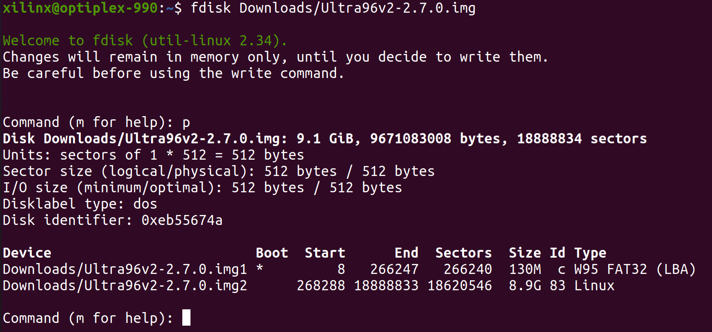

# Ultra96-NFS-Boot
This is an instruction to build the PYNQ v2.7 image for Ultra96-V2 board with root filesystem from NFS (Network File System).

## Build Environment
* Ubuntu 20.04
* Vitis 2020.2
* PetaLinux 2020.2

## Steps
### Prepare NFS folder on host
>A NFS server should be setup on the host with some folders being shared
1. Download the **PYNQ v2.7** SD card image for **Ultra96-V2** board from PYNQ [official website](http://www.pynq.io/board.html)
1. We need files in the **second partition** of the image file. First check out the **start** offset of the **second partition**.
    ```shell
    fdisk <path_to_img>/Ultra96v2-2.7.0.img
    ```
    Then enter **p** from keyboard.
    <p align="center">
    
    </p>
    <p align = "center">
    </p>

    Here the offset is **268288**.
1. Mount the second partition with **offset = 268288*512 = 137363456**
    ```shell
    mount -o loop,offset=137363456 <path_to_img>/Ultra96v2-2.7.0.img <mount_path>/
    ```
1. Copy all the files to NFS shared folder
    ```shell
    cp <mount_path>/* <NFS_shared_folder>
    ```

### Build the boot files
1. Clone the PYNQ repository from github.
    ```shell
    git clone https://github.com/Xilinx/PYNQ.git --branch image_v2.7
    ```
    ```shell
    cd PYNQ
    ```
1. Copy the **Ultra96v2** folder in this repository to **boards** folder.
1. Edit the file **sdbuild/boot/meta-pynq/recipes-kernel/linux/linux-xlnx/pynq.cfg**, modify line 12 to mark the RTL8152 driver as built-in.
    ```
    CONFIG_USB_RTL8152=y
    ```
1. Open and edit the file **sdbuild/Makefile**.
    * **Delete** line 145 and 146
    * **Incert** below three lines around line 146, replace the field "/NFS/rootfs" and "192.168.1.x" with the NFS path and the IP address of NFS server 
        ```
        echo 'CONFIG_SUBSYSTEM_ROOTFS_NFS=y' >> $$(PL_CONFIG_$1)
        echo 'CONFIG_SUBSYSTEM_NFSROOT_DIR="/NFS/rootfs"' >> $$(PL_CONFIG_$1)
        echo 'CONFIG_SUBSYSTEM_NFSSERVER_IP="192.168.1.x"' >> $$(PL_CONFIG_$1)
        ```    
1. Edit the file **sdbuild/boot/meta-pynq/recipes-bsp/device-tree/files/pynq_bootargs.dtsi**, change the bootargs in line 3:
    ```
    bootargs = "root=/dev/nfs nfsroot=192.168.1.x:/NFS/rootfs,nfsvers=3,tcp ip=dhcp rw rootwait earlyprintk devtmpfs.mount=1 uio_pdrv_genirq.of_id=\"generic-uio\" clk_ignore_unused";
    ```
    Replace the field "/NFS/rootfs" and "192.168.1.x" as above.
1. Setup environment
    ```shell
    source <Vitis_installation_path>/settings64.sh
    source <PetaLinux_installation_path>/settings.sh
    ```
    ```shell
    sudo sdbuild/scripts/setup_host.sh
    ```
1. Run `make` to start build
    ```shell
    cd sdbuild
    ```
    ```shell
    make boot_files BOARDS=Ultra96v2
    ```
1. When finished, the boot files (boot.scr, BOOT.BIN, image.ub) are saved in **sdbuild/output/boot/Ultra96v2/**
1. Replace the files in the fist partition of SD card with the newly built files.